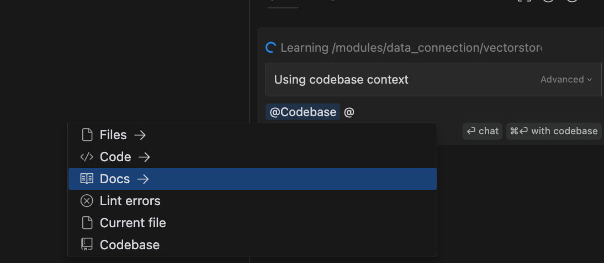

# Features
- Multifile edits
  - Making a local change and figuring out the places where the code gets broken and trying to iteratively fix them. For example adding a new parameter to a function should be trivial
  - Planning out a larger change across the components of the codebase by leaving breakcrumbs in the codebase as comments / bookmarks (using bookmarks extension)
  - One time
  - Persistent - adding a new UI feature
    - Redux model
    - Initial value
    - Case reducer
- Run the compiler and generate inline errors
  - Add comments to all the files (as submitted to the LLM) with the errors inline to avoid messing up the code layout
  - It would be nice if we can just get the symbol that is causing the issue so the file where the symbol is defined was also included in the context automatically
- Staging area already provides most of the bread you might need for some modifications, simply submit git diff
- Workspace changes
  - Adding a new file
- Making legal moves
  - Factoring out variables
  - Splitting up functions
  - Renamings
- Testing that the codebase compiles - we assume its a strict type system.
- I feel like if it compiles its good to go
- Maybe generate a plan first with type signatures and developer would approve it?
- Create copies of the repo and try different approaches and then try to compile
- Context - see what continue did. @google @url @< some actual symbol from code > are good starts
  - 
- Keep bread in the codebase until the change is complete
  - Also add @bread comments as llm runs and touches files due to bread mentions
- Watch for // bread: Refactor this function :hits-enter 2ce? Once such a comment is detected - automatically run the llm and apply the changes
- @url: @shell
- Copy paste tsc output to the bread file
- Try again
- Run wipe table command to remove all bread
- Artificially delay generation by roughly one line so we can more intelligently change only the lines that need chaning. See how continue did this (ask continue with code selection)
- Replace bread with in editor selections
- UI Cool fade in lines that are still being generated instead of streaming - its distracting
- Extract prompts from linter setup, for example lintrc
