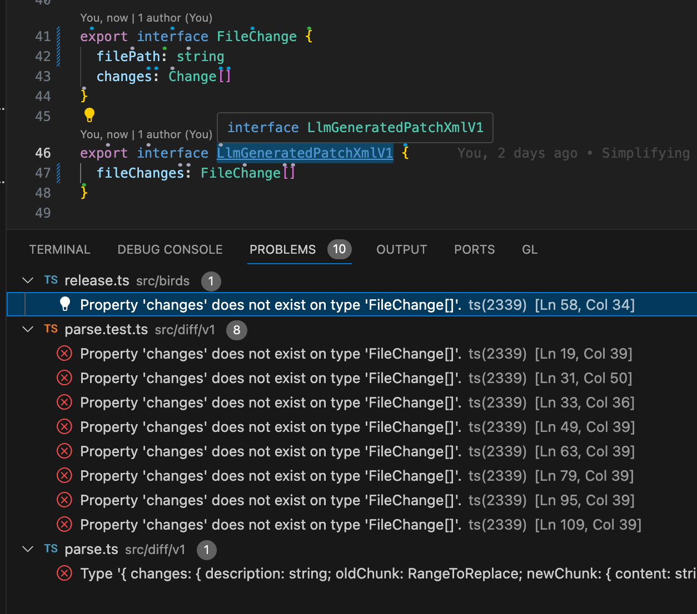
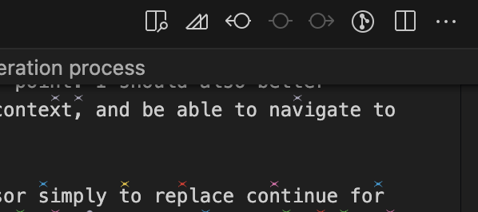

Looking at all the use cases and thus directions I could go, I decided to test the current solution and try to market it as is to some users.

Next in line is probably better insights and control of the generation. I should be able to stop generation at any point. I should also better understand what files were included as context, and be able to navigate to them quickly.

I might later attempt continuing at cursor simply to replace continue for small modifications. Again this feels like the wrong direction to go as of right now. I have something working already, there might be use case I need to double down and check if there is a legitimate use case by trying to sell.

# [Theoretically addressed - TEST, Advertise] Tedious test file edits due to data structure changes

- Add export to all constants in a file
- Update data structure string -> { content: string, someFlag: boolean }
  - compilation will fail and you want to automatically fix it across the codebase
  - 
  - Maybe you show it how to fix one of these problems manually
  - You can also provide heuristics for how to fix it, the problem old as day is - oh, I now need this new data thats unavailable in this context, let me pass it in as a parameter, oh, oh oh.
  - Solve this publically! Github will literally roll this out in a week / month
- Split a then chain into multiple awaits

- Find all places in the code base with plural or singular variable names not matching the type can be inferred

# Better insight and control generation process

I think notebooks make much more sense compared to just displaying a markdown file, because this provides a common chat like interface to the process. This kind of goes against the bet of not building user interfaces, but clearly some user interfaces necessary, en by using notebooks were reusing majority of the chat functionality we inherit from notebooks.

There's plenty of unknowns. Let's first try to squeeze out as much as we can from the file based approach. Even though I know it's inherently not powerful enough.

For instance there's buttons we can put up top of the file that can provide additional actions. See top of this file for example right side: 

It's a good idea to play around with notebooks to see what they can provide us with.

# Continue at cursor

Leave a breaded comment and had entered twice to invoke completion.

## Why do this or not do this

- Continue already supports this. Not new
- Cost time, increasing complexity of the cold base
- [Up] I kind of need thus to replace continue as of now
- [Up] People might not want to mix multiple tools doing a similar thing
- [Up] The instructions are actually given in line using comments which is the innovation here.

## Primitives required

- Watch current editor contents
  - [Workaround] Simply have a command that you run manually
- Single file editing prompt to skip the planning stage or complex xml output format. Start printing out directly into the file

# Define the task in a single file or notebook instead of spreading out @bread comments

Notebooks, or other bread files focused on user friendly autocomplete context task building and execution. Currently execution is being logged in a single markdown file. The task is only provided by either compilation errors or inline comments.

## Primitives required

- Bread files that can include other files
- Language server that can provide autocomplete for bread files
  - File names
  - Symbol names (Cursor already does that)
- Nice highlighting for the file

## Problems it solves

- No need to find the files and actually comment them with bread to include them for consideration
- Assemble the task in one place

## Shortcuts

- Use plain urls
- Use relative file urls as file://./backlog.md

# [50% addressable with a small modification to the prompt + application algorithm] Bootstrapping a new feature across multiple files potentially creating new files

## Primitives required

- Tool selection (ideally function calling)
- Tool to create new files
- Tool to rename files
- Ideally bread files that can include other files, they should also have auto complete.

## Workarounds without the tools

- We can assume if the file was not found and the path was complete that we are trying to create a new file. Add this to the prompt.
- Avoid renaming files problem.
- Add a bred comment to the file that we want to include for reference

## Flow

I will pretend that I have a smart tool to convert my desires into code assuming it has ability to create new files and edit existing files et.

Previously I was very discouraged from multi file edits because I looked at one old commit and saw that it was going to be hard to create that commit with a single multi file edit. The idea with multi file edits is that it will take multiple small intermediate steps to get there. You usually start out with a stub one implementing a new feature. For example like the but renaming idea by Isaiah.

To create code to chase and fix errors I roughly see providing these instructions
Actually I am providing these instructions but just to myself

- Create top level command chase-errors in this directory in a new file
- Register it in the extension.ts
- Updated in the package
- Rename release.ts chase-bread.ts, and its test file
- ...I have not actually completed this and continued coding the way I knew how

# [90% achievable with a more reliable simpler solution] Using summarization figure out what files to consider modifying in the first place, as well as what should be added as context

## Primitives required

- Code symbol extraction
- File purpose summarization
- Summarization caching

## Downsides

- Hard problem with many unknowns, will be slower and probably will have worse performance than manually picking out the context
- Same results can be achieved with manually picking out the context using better bread files with auto complete
- Contradicts the bet of what you sees what you get by requiring cashing

# [Technically very attractive, but premature. Focus on first customer to use out of the box tools instead] Allow scripting

The idea is to provide the user the ability to script their own workflows off badge source updates.

## Downsides

- There's really no primitive to work with right now
- Attracting a customer who would be willing to customize things is really hard. To interest someone in investing time into learning the pi because there is a learning curve always, they need to experience out of the box functionality and like it. The only reason they would like to script is because they really like the multi file editing or simply the approach I'm taking with the comments, VSCode integration with highlighting regions about to be edited

# Small ones, not direction, simply examples and things to try

## [Scripting / summarization / auto selection] Migrate from pnpm to npm

- Update scripts
- Update docs

Is ai needed for this?

# Add helpers for ``` and new lines to appendToDocument and logger

I have a function that appends to a document, but it does not create leading new lines, I want to have more helpers like
appendNewLine
or appendNewMarkdownBlock.
I then want to find all uses of that function and automatically refactor to use the new abstractions.

### Blocked by

- Simple @search context provider
- Scripting
- Or automatic symbol / summaries

# I got mermaid to finally work with esbuild etc, I now have a shit load of code thats just 'chilling'

I want to strip it, I want to also just reorganize the code in a better way but keep it working.
Very generic ...

# I want to document decision making in the code base

I know the codebase, but other people don't and I will not either soon.
So I can run a script to ask me questions about the codebase to add more documentation.

## Blocked by

- Whole codebase understanding
- Prompt to identify 'gaps' in decision documentation
- Symbol extraction for code base
- Interrupts for user input
