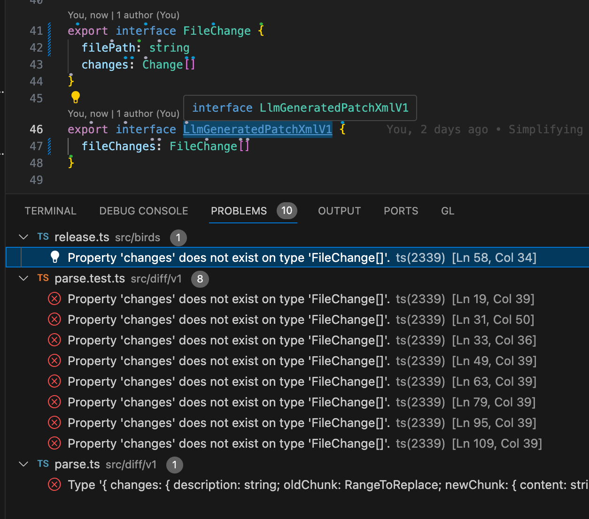

- Add export to all constants in a file
- Update data structure string -> { content: string, someFlag: boolean }
  - compilation will fail and you want to automatically fix it across the codebase
  - 
  - Maybe you show it how to fix one of these problems manually
  - You can also provide heuristics for how to fix it, the problem old as day is - oh, I now need this new data thats unavailable in this context, let me pass it in as a parameter, oh, oh oh.
  - Solve this publically! Github will literally roll this out in a week / month
- Split a then chain into multiple awaits

- Find all places in the code base with plural or singular variable names not matching the type can be inferred
