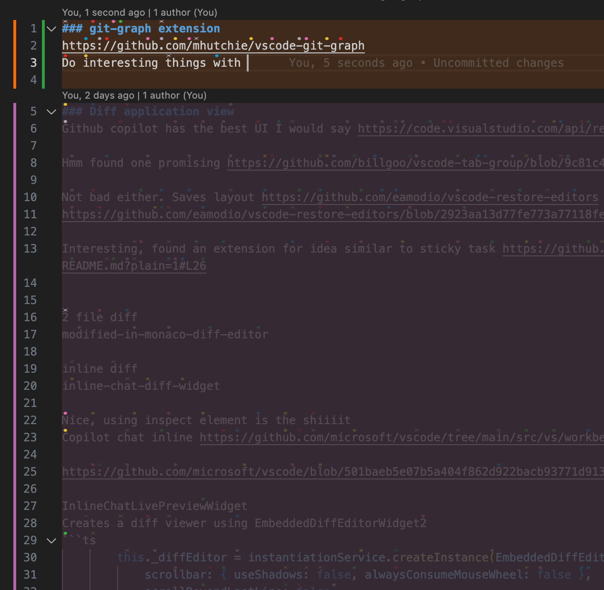
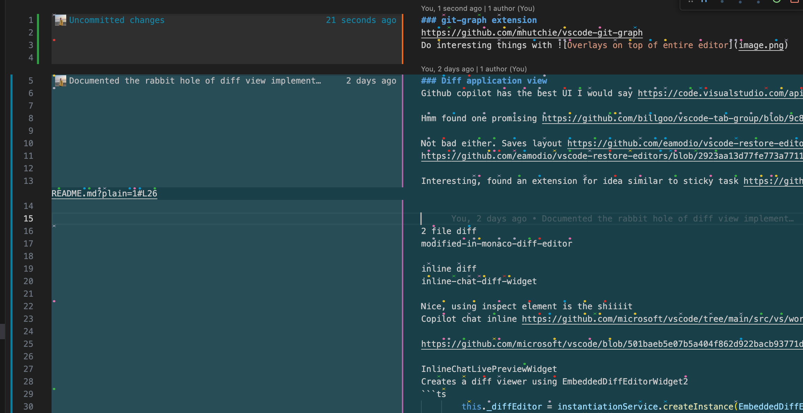

### git-graph extension
This is promising

https://github.com/mhutchie/vscode-git-graph
Do interesting things with 


### Diff application view
Github copilot has the best UI I would say https://code.visualstudio.com/api/references/vscode-api#TabInputTextDiff

Hmm found one promising https://github.com/billgoo/vscode-tab-group/blob/9c81c47d708f378636927897a74f474bf3c8473e/src/TabTypeHandler.ts#L121

Not bad either. Saves layout https://github.com/eamodio/vscode-restore-editors
https://github.com/eamodio/vscode-restore-editors/blob/2923aa13d77fe773a77118feaff5d35a65890bd0/src/layoutManager.ts#L224

Interesting, found an extension for idea similar to sticky task https://github.com/marlomgirardi/vscode-keep-context/blob/10a08a76e8b64a210b6712e668bf4960c5054774/README.md?plain=1#L26


2 file diff
modified-in-monaco-diff-editor

inline diff
inline-chat-diff-widget

Nice, using inspect element is the shiiiit
Copilot chat inline https://github.com/microsoft/vscode/tree/main/src/vs/workbench/contrib/inlineChat

https://github.com/microsoft/vscode/blob/501baeb5e07b5a404f862d922bacb93771d91331/src/vs/workbench/contrib/inlineChat/browser/inlineChatLivePreviewWidget.ts#L43

InlineChatLivePreviewWidget
Creates a diff viewer using EmbeddedDiffEditorWidget2
```ts
		this._diffEditor = instantiationService.createInstance(EmbeddedDiffEditorWidget2, this._elements.domNode, {
			scrollbar: { useShadows: false, alwaysConsumeMouseWheel: false },
			scrollBeyondLastLine: false,
			renderMarginRevertIcon: true,
			renderOverviewRuler: false,
			rulers: undefined,
			overviewRulerBorder: undefined,
			overviewRulerLanes: 0,
			diffAlgorithm: 'advanced',
			splitViewDefaultRatio: 0.35,
			padding: { top: 0, bottom: 0 },
			folding: false,
			diffCodeLens: false,
			stickyScroll: { enabled: false },
			minimap: { enabled: false },
			isInEmbeddedEditor: true,
			overflowWidgetsDomNode: editor.getOverflowWidgetsDomNode(),
			onlyShowAccessibleDiffViewer: this.accessibilityService.isScreenReaderOptimized(),
		}, {
			originalEditor: { contributions: diffContributions },
			modifiedEditor: { contributions: diffContributions }
		}, editor);
```

microsoft uses this syntax: TODO@jrieken find a better fix for this. this is the challenge:

Obviously they need to do smart things with hiding the lines of the code that are overlapping with the diff editor.
```ts
const modified = this.editor.getModel()!;
const ranges = this._computeHiddenRanges(modified, range, changes);

this._hideEditorRanges(this.editor, [ranges.modifiedHidden]);
this._hideEditorRanges(this._diffEditor.getOriginalEditor(), ranges.originalDiffHidden);
this._hideEditorRanges(this._diffEditor.getModifiedEditor(), ranges.modifiedDiffHidden);

this._diffEditor.revealLine(ranges.modifiedHidden.startLineNumber, ScrollType.Immediate);

const lineCountModified = ranges.modifiedHidden.length;
const lineCountOriginal = ranges.originalHidden.length;

const lineHeightDiff = Math.max(lineCountModified, lineCountOriginal);
const lineHeightPadding = (this.editor.getOption(EditorOption.lineHeight) / 12) /* padding-top/bottom*/;
const heightInLines = lineHeightDiff + lineHeightPadding;

super.show(ranges.anchor, heightInLines);
this._logService.debug(`[IE] diff SHOWING at ${ranges.anchor} with ${heightInLines} lines height`);
```
